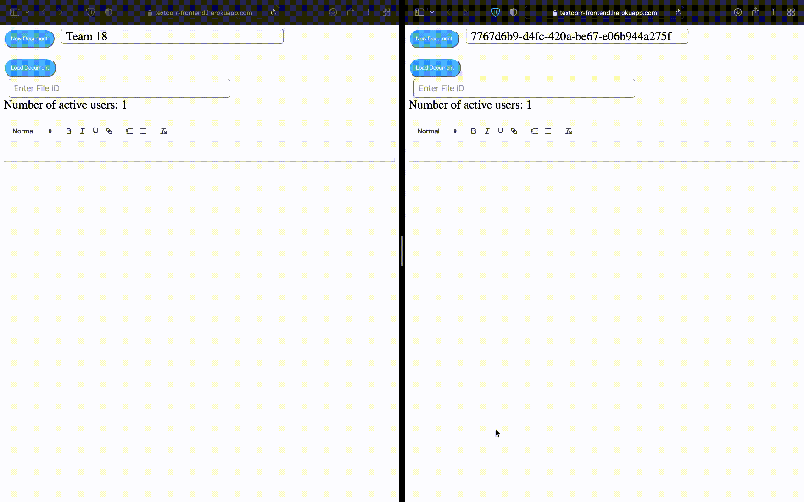

<div id="top"></div>


<!-- PROJECT LOGO -->
<br />
<div align="center">
  <a href="https://github.com/Abouraya11/Distributed-Text-Editor.git">
    
  </a>

  <h3 align="center">Distributed Text Editor Team 18</h3>

  <p align="center">
    A real time text editor project in the Distributed Computing Course under the supervision of Prof. Ayman Bahaa and Eng. Mostafa Ashraf
    <br />
    <a href="https://textoorr-frontend.herokuapp.com" target="_blank"><strong>Explore the deployed project</strong></a>
    <br />
    <br />
  </p>
</div>


<!-- TABLE OF CONTENTS -->
<details>
  <summary>Table of Contents</summary>
  <ol>
    <li>
      <a href="#Project Description">Project Description</a>
      <ul>
        <li><a href="#built-with">Built With</a></li>
      </ul>
    </li>
    <li>
      <a href="#getting-started">Getting Started</a>
      <ul>
        <li><a href="#prerequisites">Prerequisites</a></li>
        <li><a href="#installation">Installation</a></li>
      </ul>
    </li>
    <li><a href="#contact">Contributers</a></li>
  </ol>
</details>


<!-- PROJECT DESCRIPTION -->
## Project Description



Our project is a collaborative/multi-user distributed real-time text editor implemented with React and Node JS. The main goal of the project is building text-editor that supports creating new documents, loading, editing and viewing already created documents and this can be done multiple users or participants synchronously, that was achieved successfully in our project and deployed to be easily used. 

Several users can create, edit, update documents and they can use different fonts, styles and formats nearly similar to Google docs. They can concurrently edit the same document by loading it by its ID (each document has an ID) and see changes that other user has already made. 

Our website supports features as consistency, robustness and fault tolerance.


<p align="right">(<a href="#top">back to top</a>)</p>


### Built With

Our project was built using:

* [React.js]
* [Node.js]
* [Quill]
* [MongDB]
* [Express]
* [Socket.io]

<p align="right">(<a href="#top">back to top</a>)</p>


<!-- GETTING STARTED -->
## Getting Started

We have two ways to start our application. The first way is through the deployed link that we provided at the top of the readme file. The second way is to run the application locally.

### Prerequisites

These are the things you need it installed on your computer to be able to run the project.
* npm
  ```sh
  npm install npm@latest -g
  ```

### Installation

This will tell you how to install the code and run the application in your computer locally.

1. Clone the repo or download the code in a zip file
   ```sh
   git clone https://github.com/Abouraya11/Distributed-Text-Editor.git
   ```
2. Then you need to open two terminals
3. In the first terminal make sure you are in the project folder then you need to access the backend folder inside it, write the command: 
   ```sh
   cd backend
   ```
4. In the first terminal install the NPM packages for the backend file with the following commands:

   ```sh
   npm install express@4.18.1
   ```
   ```sh
   npm install mongoose@6.3.1
   ```
   ```sh
   npm install socket.io
   ```
5. In the second terminal make sure you are in the project folder then you need to access the frontend folder inside it, write the command: 
   ```sh
   cd frontend
   ```
6. In the first terminal install the NPM packages for the frontend file with the following commands:

   ```sh
   npm install react react-dom react-r
   outer-dom react-scripts
   ```
   ```sh
   npm install socket.io-client
   ```
   ```sh
   npm install socket.io
   ```
   ```sh
   npm install uuid
   ```
   ```sh
   npm install web-vitals
   ```
7. Then in the first terminal which is the BACKEND terminal you should run the server with the command.
   ```sh
   node server
   ```
8. Then in the second terminal which is the FRONTEND terminal you should run the frontend file with the command.
   ```sh
   npm start
   ```
9. The computer should open the browser to your localhost with the project and you should be able to use our project.

<p align="right">(<a href="#top">back to top</a>)</p>


<!-- Contributers -->
## Contributers

- Omar Mohamed Tawfik ElSaeed ElKordy         (18P2055)
- Maram Motaz Youssef                                       (18P7312)
- Mazen Mahmoud Abdel Hafeez                        (18P7426)
- Youssef Mohamed Ahmed Ahmed Abouraya   (18P5796)

Project Link: [https://github.com/Abouraya11/Distributed-Text-Editor.git](https://github.com/Abouraya11/Distributed-Text-Editor.git)

Deployed Link: [https://textoorr-frontend.herokuapp.com](https://textoorr-frontend.herokuapp.com)

<p align="right">(<a href="#top">back to top</a>)</p>